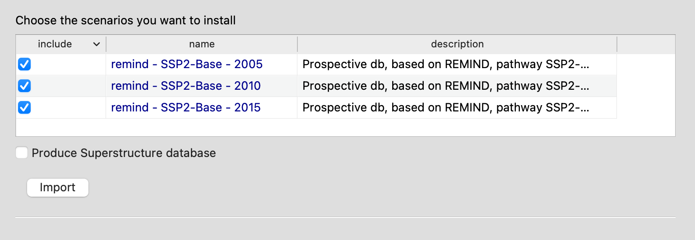

# ScenarioLink: An Activity Browser Plugin for Scenario-Based LCA Databases

ScenarioLink is a specialized plugin for the [Activity Browser](https://github.com/LCA-ActivityBrowser/activity-browser), an open-source software for Life Cycle Assessment (LCA). This plugin enables you to seamlessly fetch and reproduce scenario-based LCA databases, such as those generated by [premise](https://github.com/polca/premise), using [unfold](https://github.com/polca/unfold) datapackages.

## Features

- Reproduce individual or multiple scenario-based databases within Activity Browser.
- Merge multiple databases into a unified superstructure database containing various scenarios.
- Leverage the capabilities of the `unfold` library to recreate databases with the necessary scaling factors.

## Overview

The Activity Browser builds upon the [Brightway2](https://brightway.dev) LCA framework. ScenarioLink aims to simplify the use of scenario-based LCA databases within the Activity Browser by:

- Eliminating the need for separate tools required to generate these databases (e.g., premise).
- Utilizing `unfold` datapackages that contain scaling factors essential for reproducing scenario-based LCA databases, assuming a consistent source database (e.g., ecoinvent 3.7.1).


## Installation

1. Activate your existing Activity Browser conda environment.
2. Install the ScenarioLink plugin using Pypi or conda:

    ```bash
    pip install ab-plugin-scenariolink
    ```

    ```bash
    conda install -c romainsacchi ab-plugin-scenariolink
    ```

4. Launch the Activity Browser.
5. Navigate to `Tools > Plugins` and select ScenarioLink from the plugin list.

## Usage

### Reproduce a scenario-based database

1. Activate the plugin by selecting it from the plugin list.

    

2. After activating the plugin, select the `ScenarioLink` tab.

    

3. Select (double-click) the desired datapackage from the table.

    

4. If the datapackage selected is not present in the local cache, it will be downloaded from the remote repository.
5. Once the download is complete, a second table presents the scenarios contained in the datapackage.

    

6. Select the desired scenario(s) by checking the corresponding checkboxes.
7. Choose whether to merge the selected scenarios into a single database (superstructure database) or reproduce them individually.
8. Click `Import` to start the process.
9. The plugin will ask you to select the databases in your project that will be used as source databases.

    

10. The plugin will then reproduce the selected scenario(s) and add them to your project.

## Contributing

You can make your own scenario-based LCA databases available to the community.
To do so, you need to create a `unfold` datapackage and upload it to a remote repository.
We will then add it to the list of available datapackages in the ScenarioLink plugin.


## Maintainers

For questions, issues, or contributions, you can reach out to:

- **Marc van der Meide**: [Email](mailto:m.t.van.der.meide@cml.leidenuniv.nl)
- **Romain Sacchi**: [Email](mailto:romain.sacchi@psi.ch)

Alternatively, you can open an issue on this GitHub repository.
